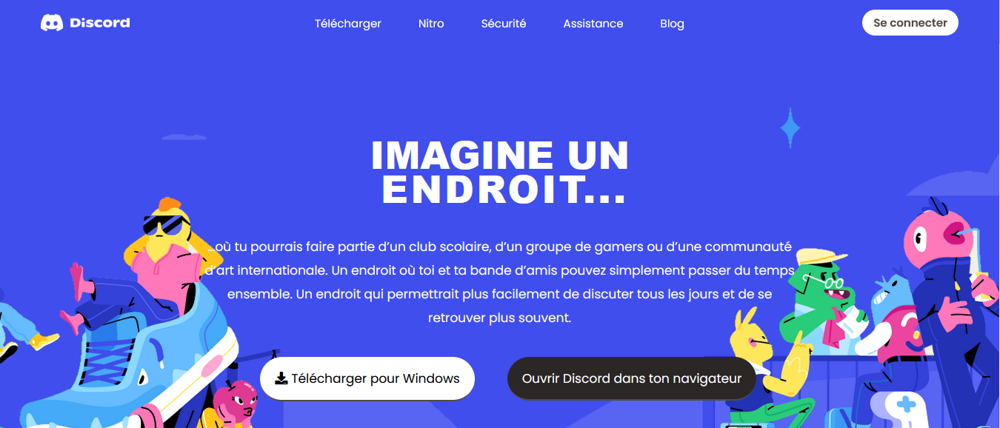
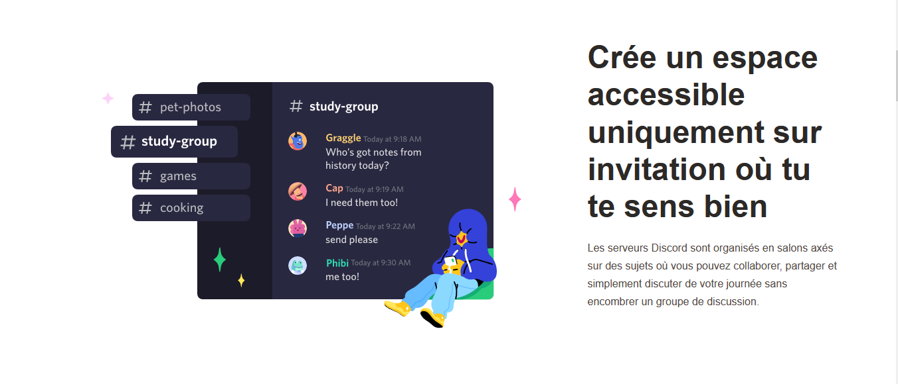
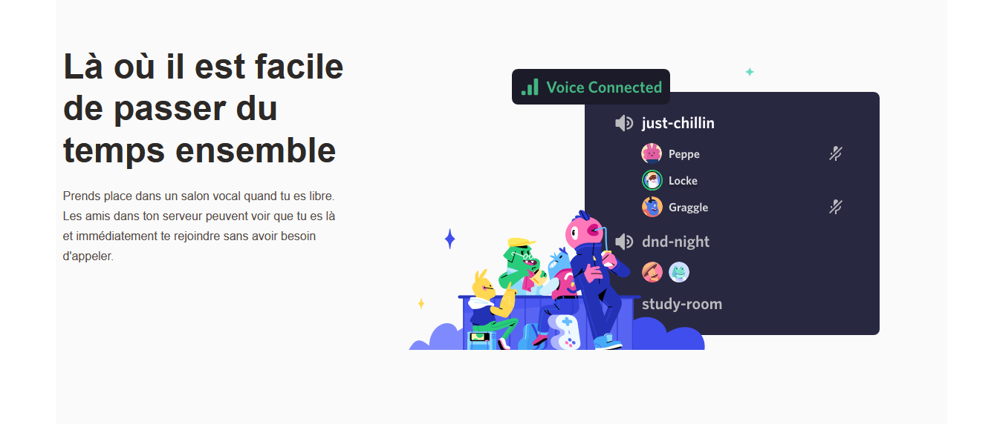

# Discord-UI-Clone

## Description
This is a clone of Discord's homepage built using [Wordpress](https://wordpress.org/), it is configured to run on the [Pantheon platform](https://pantheon.io).

## ScreenShots:

## Tools & languages:
* PHP
* CSS
* JavaScript
* Paint.net (Image editor)

## Contribution:
Feel free to fork this project and add whatever you like. If you have any suggestions or any comments please feel free to contact me or to open an issue.

## Team:
[Jetlighters](https://github.com/JetLightStudio) having fun.

